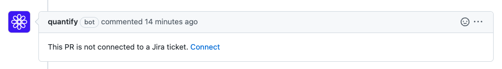
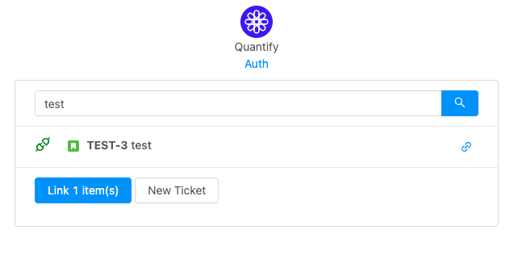
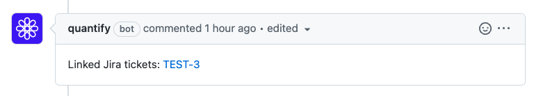

## How to enable Quantify bot

Create `.github/quantify.yml` file in your repository with the following configuration

```
jiraLinks:
  bot: true
```

## Screenshots

First step



Second step



Voilà



## Have feedback?

[Join the discussion](https://github.com/quantify/github-bot/discussions)
